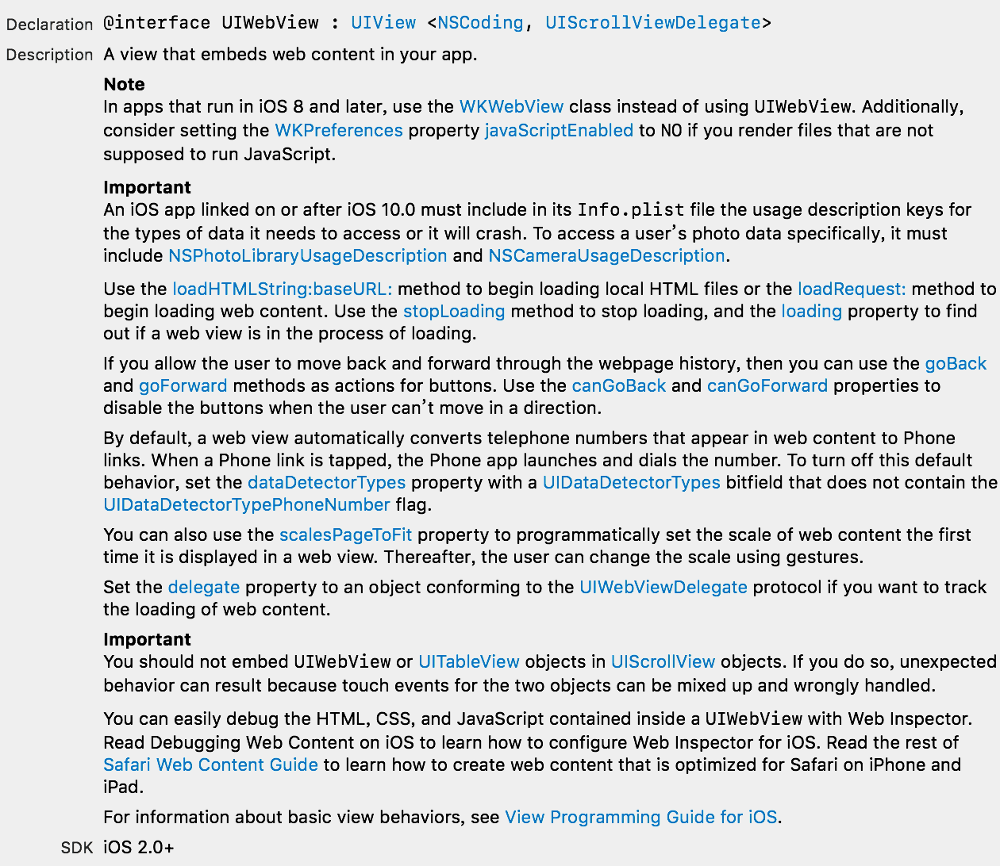
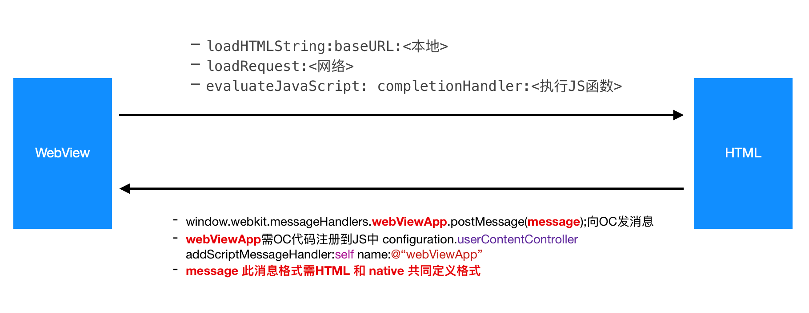

# WKWebView 的使用和封装

### 更新

#### Version 2.0 2020.02.10
集成微信/支付宝 H5 支付功能。文档见 [iOS App接入H5支付](iOS App 接入H5 支付.md)
#### Version 1.0 2018.07.03 
WKWebView 基本封装，包含本文档中功能

### 前言

> 项目中有个新闻资讯模块展示公司和相关行业的最新动态。
> 这个部分基本是以展示网页为主，内部可能会有一些 native 和 JS 代码的交互。
> 因为是新项目，所以决定采用 iOS 8 中新出的 WebKit。
> 本文是对 WebKit 框架中 WKWebView 的一些学习和封装

### UIWebView 和 WKWebView

这两者都是 iOS 中展示 web 相关的组件。前者 iOS 2.0 就有了，后者是 iOS 8.0 时候新加的。

网络中关于两者的差异和性能对比分析很多，这里不再赘述。只是说明一下苹果文档中的重要提示以及自己需要功能的实现：

官方文档中重要提示


文档中主要说了以下几点：

- iOS 8 之后，应该用 WKWebView 代替 UIWebView。并可以设置 `WKPreferences` 的 `javaScriptEnabled` 属性决定是否支持 web 内容执行 JavaScript 代码
- iOS 10 之后必须在 info.plist 文件中包含要访问数据的描述。对于图库的访问必须包含 `NSPhotoLibraryUsageDescription` 和 `NSCameraUsageDescription` 否则会直接 crash
- 加载本地 HTML 文件使用： `loadHTMLString:baseURL:` 方法
- 加载网络内容使用 ： `loadRequest:` 方法
-  `stopLoading` 方法用来结束加载。`loading` 属性查看WK进程中是否加载中
- `goBack` 和 `goForward` 方法可用于 WKWebView 的前进后退. `canGoBack` 和 `canGoForward` 属性来查看是否能前进后退
- 通常WKWebView会自动识别电话号码，并把它设置成可打电话的链接。如果不用这个功能： 设置 `dataDetectorTypes` 属性中  `UIDataDetectorTypes` 的位字段不包含 `UIDataDetectorTypePhoneNumber`.
- `scalesPageToFit` 属性用于第一次加载网页内容时候设置是否可以使用手势改变网页缩放。 设置后用户就可以手势缩放网页大小
- 记录网页加载网络内容可以设置WKWebView 的 `delegate` 并遵守 `UIWebViewDelegate` 协议
- 不要在 网页中嵌入 UIScrollView 及其子类，这样会导致手势等行为混乱

有了基本的概念，就可以去看一下 WKWebView 的具体文档了。如果怕官方文档麻烦也可以直接看网络上别人整理好的[网络整理](http://www.cocoachina.com/ios/20170413/18963.html)。

下面是我整理的 WebView 和 H5 调用逻辑图：



特别说明一点：

```objc
0. OC 执行 JS 方法
- (void)evaluateJavaScript:(NSString *)javaScriptString completionHandler:(void (^)(id, NSError *error))completionHandler;

这个方法中webView调用JS，block只是成功或失败的回调

1. JS方法中
window.webkit.messageHandlers.webViewApp.postMessage(message);
作用是JS 向之前注册的 webViewApp 发送消息。

OC 端接到消息会调用 <WKScriptMessageHandler> 中下面代理方法
- (void)userContentController:(WKUserContentController *)userContentController didReceiveScriptMessage:(WKScriptMessage *)message
```

### 功能需求

对于项目而言，网页功能无需太多，主要满足以下几点

**基本展示功能**

1. 导航栏下显示加载进度条 
2. 导航栏 title 展示网页内容当前 title
3. 网页内容的刷新、前进、后退
4. 网页内容加载、刷新过程中 HUD 提示

**JS和OC交互功能：交互的数据格式和方法名等需要和H5端具体协调**

1. App内登录后，访问 web 需要对应用户token
2. 网页中点击超链接，新开页面处理，同上也需要拦截新URL请求并补全token参数
3. 跟JS交互中对JS返回值的处理
4. 简单JS代码注入，如资讯内容底部加一些赞和分享等功能<曾经就有接口只返回一段JS>

以上这些基本功能中基本展示功能都比较简单，和JS交互的部分需要和 H5 端小伙伴共同定义数据结构和互调的方法名、参数等。所以需要具体问题具体分析。项目以我自己 Demo 为例说一下。

### 功能实现

为实现功能主要封装了三个类

```objc
XYWKWebViewController  ---> 管理 webView 加载相关的代理方法
XYWKWebView            ---> 封装 webView 请求相关方法
XYScriptMessage        ---> 封装JS回调信息
```

XYWKWebView 核心功能

**加载本地HTML文件**

```objc
/**
 *  加载本地HTML页面
 *
 *  @param htmlName html页面文件名称
 */
- (void)loadLocalHTMLWithFileName:(nonnull NSString *)htmlName
```
实现代码

```objc
- (void)loadLocalHTMLWithFileName:(nonnull NSString *)htmlName {

    NSString *path = [[NSBundle mainBundle] bundlePath];
    NSURL *baseURL = [NSURL fileURLWithPath:path];
    NSString * htmlPath = [[NSBundle mainBundle] pathForResource:htmlName
                                                          ofType:@"html"];
    NSString * htmlCont = [NSString stringWithContentsOfFile:htmlPath
                                                    encoding:NSUTF8StringEncoding
                                                       error:nil];
    
    // WKWebView 的 loadHTMLString: 方法
    [self loadHTMLString:htmlCont baseURL:baseURL];
}

```

**加载网络内容**

```objc
// 加载网络内容，根据是否有参数选不同方法
- (void)loadRequestWithRelativeUrl:(nonnull NSString *)relativeUrl;

- (void)loadRequestWithRelativeUrl:(nonnull NSString *)relativeUrl params:(nullable NSDictionary *)params;
```
实现代码

```objc
- (void)loadRequestWithRelativeUrl:(NSString *)relativeUrl params:(NSDictionary *)params {
    
    NSURL *url = [self generateURL:relativeUrl params:params];
    
    [self loadRequest:[NSURLRequest requestWithURL:url]];
}

- (NSURL *)generateURL:(NSString*)baseURL params:(NSDictionary*)params {
    
    self.webViewRequestUrl = baseURL;
    self.webViewRequestParams = params;
    
    NSMutableDictionary *param = [NSMutableDictionary dictionaryWithDictionary:params];
    
    NSMutableArray* pairs = [NSMutableArray array];

    //可以在这里将token参数添加进去，这样就可以实现补全token功能    
    for (NSString* key in param.keyEnumerator) {
        NSString *value = [NSString stringWithFormat:@"%@",[param objectForKey:key]];

        NSString* escaped_value = (__bridge_transfer NSString *)CFURLCreateStringByAddingPercentEscapes(NULL,
                                                                              (__bridge CFStringRef)value,
                                                                              NULL,
                                                                              (CFStringRef)@"!*'\"();:@&=+$,/?%#[]% ",
                                                                              kCFStringEncodingUTF8);
        
        [pairs addObject:[NSString stringWithFormat:@"%@=%@", key, escaped_value]];
    }
    
    NSString *query = [pairs componentsJoinedByString:@"&"];
    baseURL = [baseURL stringByAddingPercentEscapesUsingEncoding:NSUTF8StringEncoding];
    
    NSString* url = @"";
    if ([baseURL containsString:@"?"]) {
        url = [NSString stringWithFormat:@"%@&%@",baseURL, query];
    }
    else {
        url = [NSString stringWithFormat:@"%@?%@",baseURL, query];
    }
    //绝对地址
    if ([url.lowercaseString hasPrefix:@"http"]) {
        return [NSURL URLWithString:url];
    }
    else {
        return [NSURL URLWithString:url relativeToURL:self.baseUrl];
    }
}
```

XYWKWebViewController 核心功能

这是一个 Controller，建议创建新的Controller继承XYWKWebViewController 来使用，这样可以把不同的页面区分开，每个页面加载的url和相关的业务逻辑都可以单独处理，代码易读，也容易维护。如果项目后期添加功能也好处理
XYWKWebViewController主要完成了对一些功能的封装，比如进度条、页面title以及 webView 的生命周期。

进度条和title都是通过KVO实现

```objc
if (self.shouldShowProgress) {
   [self.webView addObserver:self forKeyPath:@"estimatedProgress" options:NSKeyValueObservingOptionNew context:NULL];
}

if (self.isUseWebPageTitle) {
   [self.webView addObserver:self forKeyPath:@"title" options:NSKeyValueObservingOptionNew context:NULL];
}
```

设置title 和 progressView 直接是自己简单写了一个 View 

```
- (void)observeValueForKeyPath:(NSString *)keyPath ofObject:(id)object change:(NSDictionary<NSString *,id> *)change context:(void *)context {
    if ([keyPath isEqualToString:@"estimatedProgress"]) {
        
        if (object == self.webView) {
            [self showLoadingProgress:self.webView.estimatedProgress andTintColor:[UIColor colorWithRed:24/255.0 green:124/255.0 blue:244/255.0f alpha:1.0]];
        }
        else{
            [super observeValueForKeyPath:keyPath ofObject:object change:change context:context];
        }
    }
    else if ([keyPath isEqualToString:@"title"]){
        if (object == self.webView) {
            if ([self isUseWebPageTitle]) {
                self.title = self.webView.title;
            }
        }
        else{
            [super observeValueForKeyPath:keyPath ofObject:object change:change context:context];
        }
    }
    else {
        [super observeValueForKeyPath:keyPath ofObject:object change:change context:context];
    }
}
```

**OC 与 JS 之间交互的处理**

这部分是可定制化功能最多的，遇到的问题也是最多的。WKWebView 和 JS 之间的交互需要设置 ScriptMessageHandler 如下。

```objc
- (instancetype)initWithFrame:(CGRect)frame configuration:(WKWebViewConfiguration *)configuration {
    self = [super initWithFrame:frame configuration:configuration];
    if (self) {
    
        if (configuration) {
        
            //文档中说
            //Adds a script message handler.
            //Adding a script message handler with name name causes the JavaScript function window.webkit.messageHandlers.name.postMessage(messageBody) to be defined in all frames in all web views that use the user content controller.
        
            // 这里就是设置 网页中 JS Message handler
            // 通过 “name” 注册之后，JS 内部函数 window.webkit.messageHandlers.“name”.postMessage(messageBody) 就被定义到整个用户的Web内容的控制器中。
            //后面的JS调用OC也是通过 “name” 联系的
            [configuration.userContentController addScriptMessageHandler:self name:@"webViewApp"];
        }
        
        //默认允许系统自带的侧滑后退
        self.allowsBackForwardNavigationGestures = YES;
    }
    return self;
}
```

然后实现 WKScriptMessageHandler 代理

```objc

// JS 调用 OC 的回调。JS 向OC 发送消息会调用这个方法
- (void)userContentController:(WKUserContentController *)userContentController didReceiveScriptMessage:(WKScriptMessage *)message {
    
    NSLog(@"得到的 JS message 是 :%@",message.body);
    if ([message.body isKindOfClass:[NSDictionary class]]) {
        
        NSDictionary *body = (NSDictionary *)message.body;
        
        // 这里是对 JS 消息的一个处理，用自己定义的消息类型，封装并发送给代理去外部处理，具体格式需要工作中和H5共同制定
        
        XYScriptMessage *msg = [XYScriptMessage new];
        [msg setValuesForKeysWithDictionary:body];
        
        if (self.xy_messageHandlerDelegate && [self.xy_messageHandlerDelegate respondsToSelector:@selector(xy_webView:didReceiveScriptMessage:)]) {
            [self.xy_messageHandlerDelegate xy_webView:self didReceiveScriptMessage:msg];
        }
    }
    
}
```

其中自定义的 XYScriptMessage 如下

```objc
/**
 *  WKWebView与JS调用时参数规范实体
 */
@interface XYScriptMessage : NSObject

/**
 *  方法名
 *  用来确定Native App的执行逻辑
 */
@property (nonatomic, copy) NSString *method;

/**
 *  方法参数
 *  json字符串
 */
@property (nonatomic, copy) NSDictionary *params;

/**
 *  回调函数名
 *  Native App执行完后回调的JS方法名
 */
@property (nonatomic, copy) NSString *callback;

@end
```

同时提供delegate方法供XYWKWebViewController实现

```objc
/**
 *  JS调用原生方法处理，其中方法名都需要和 H5 端相互协调
 */
- (void)xy_webView:(XYWKWebView *)webView didReceiveScriptMessage:(XYScriptMessage *)message {
    
    NSLog(@"webView method:%@",message.method);
    
    //返回上一页
    if ([message.method isEqualToString:@"tobackpage"]) {
        [self.navigationController popViewControllerAnimated:YES];
    }
    //打开新页面
    else if ([message.method isEqualToString:@"openappurl"]) {
        
        NSString *url = [message.params objectForKey:@"url"];
        if (url.length) {
            XYWKWebViewController *webViewController = [[XYWKWebViewController alloc] init];
            webViewController.url = url;
            
            [self.navigationController pushViewController:webViewController animated:YES];
        }
    }
}
```


### 使用方法

一个提供四类使用功能，使用方法建议直接继承 XYWKWebViewController。

```swift
class WebViewController: XYWKWebViewController {

    override func viewDidLoad() {
        super.viewDidLoad()
        
        /// #用法0： 直接加载对应的地址 <没有参数>
        //self.webView.loadRequest(withRelativeUrl: "https://www.httpbin.org/")
        
        /// #用法1： 直接加载对应的地址 <有参数>
        //let params = ["name":"xiaoyou",
        //              "password" : "123456#/HTTP_Methods/get_get"]
        //self.webView.loadRequest(withRelativeUrl: "https://www.httpbin.org/", params: params)
        
        /// #用法2： 直接加载本地HTML文件 <没有参数>
        self.webView.loadLocalHTML(withFileName: "main")
        
        /// #用法3： JS 注入，添加一些方法 <这里的原生坐标和JS之间无法直接相对应>
        let margin : CGFloat = 6.0
        let padding : CGFloat = 10.0
        let width = UIScreen.main.bounds.size.width - (margin * 2.0) - (margin * 7.0 + padding)
        let btnWidth = (width - padding - 5) / 2.0
        
        let styleJS = """
                    <style type="text/css">
                    #foot {
                        border:solid 10px #600;
                        padding:\(padding)px;
                        margin:\(margin)px;
                        clear:both;
                        width:\(width)px
                    }
                    #share {
                        border:solid 1px #600;
                        padding:2px;
                        margin:2px;
                        clear:both;
                        width:\(btnWidth)px;
                        heiht:150px
                    }
                    #like {
                        border:solid 1px #600;
                        padding:2px;
                        margin:2px;
                        clear:both;
                        width:\(btnWidth)px;
                        heiht:50px
                    }
                    </style>
                    """
        
        let funcJS = """
                    \t\t\tfunction testFunc(text){\n
                    \t\t\t\tvar message = \"点我干什么\";\n
                    \t\t\t\twindow.webkit.messageHandlers.webViewApp.postMessage(message);\n
                    \t\t\t\talert(text);\n
                    \t\t\t}\n
                    """
        
        let footerJS = """
                    \t<button onclick=\"testFunc('http://www.baidu.com/')\">自己添加的Footer的Button一个</button><br /><br /><br />\n
                    \t <div id=\"foot\">底部说明 <br />
                    <button id=\"share\" onclick=\"testFunc('分享')\">分享</button>
                    <button id=\"like\" onclick=\"testFunc('点赞')\">点赞</button><br />
                    </div>
                    """
        self.webView.loadLocalHTML("main", withAddingStyleJS: styleJS, funcJS: funcJS, footerJS: footerJS)
        
        /// 设置导航
        self.navigationItem.leftBarButtonItem = UIBarButtonItem(title: "返回", style: .plain, target: self, action: #selector(backAction));
        self.navigationItem.rightBarButtonItem = UIBarButtonItem(title: "调用JS", style: .plain, target: self, action: #selector(callJS));
    }
}


/// #用法4： OC 调用JS方法。这里可以调用JS，把H5需要的参数传给他们
///  这里是JS 回调方法
extension WebViewController{
    
    @objc func backAction() {
        self.dismiss(animated: true, completion: nil)
    }
    
    @objc func callJS() {
        self.webView.callJS("call('Hello World!')") { (response) in
            print("\(String(describing: response))")
        }
    }
    
    /// 这里是重写了WebView接受到JS消息的回调，需要调用super方法才能执行内部方法，否则这里只是打印
    override func xy_webView(_ webView: XYWKWebView, didReceive message: XYScriptMessage) {
        
        // 如果完全自定义的js方法处理，无需重写父类，自行实现即可
        super.xy_webView(webView, didReceive: message)
        print(message)
    }
    
}

```

具体见Demo


### 遇到的问题

HTML 中超链接，需要打开新页面的["_blank"处理](https://www.jianshu.com/p/3a75d7348843)

### 小结

WebKit 的小封装能实现目前所需功能，但很多内容还需要在需要的时候去探究，希望能帮到同样学习的小伙伴。

如果看完有收获，不妨点个✨，让我也更有分享的动力！


